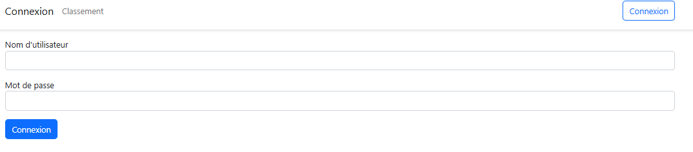
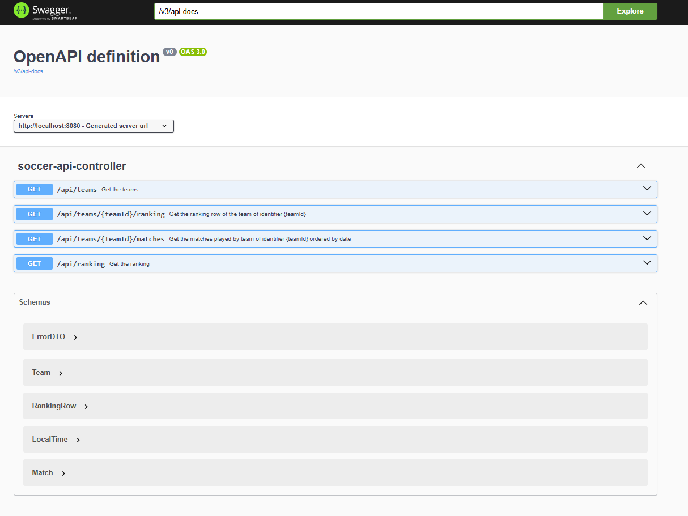
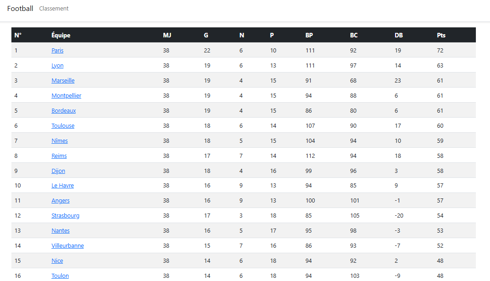
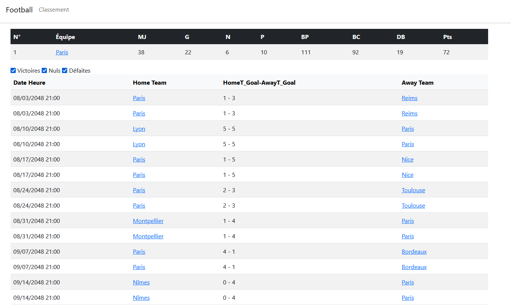

This project is a championship management system built to showcase best practices in software architecture, dependency injection, authorization(Spring security), and testing using Spring Boot, with both Server-Side Rendering (SSR) via Thymeleaf and Client-Side Rendering (CSR) via Angular. The API is documented using Swagger/OpenAPI.

---

## 📂 Technologies Used
- **Backend (API):** Spring Boot  
- **Security:** Spring Security  
- **SSR (UI):** Thymeleaf  
- **CSR (UI):** Angular  
- **Documentation:** Swagger / OpenAPI  
- **Testing:** JUnit, Mockito  
- **Build Tool:** Maven
---
## 📸 Screenshots

### 🔐 Login Page

---

### 📖 Swagger API Documentation

---

### 🏅 Team Ranking / Classement (Thymeleaf)

---

### 📋 Team Details

